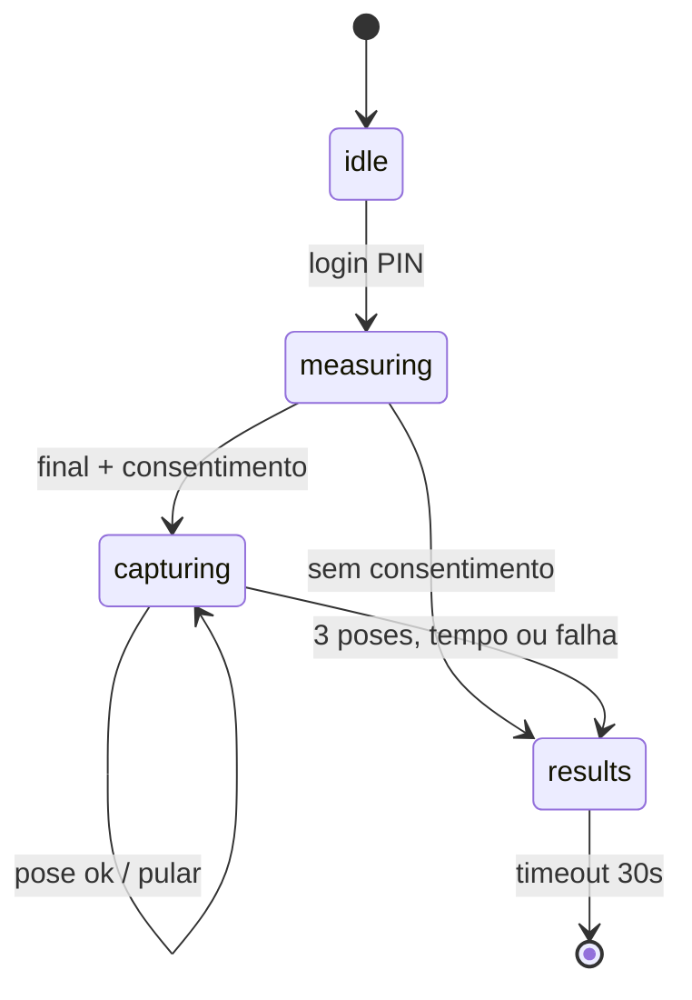

# PRD v3 — Fotometria Corporal (melhorias em etapas)

2026-09-22 · @Someone

## Resumo

O PRD 2.0 tem a ideia certa (autocaptura guiada de 3 poses, vinculada à medição, no comparador e no PDF), mas não pode ser implementado como está: confrontado com o código do repositório `Admsmartfit/balanca`, ele tem 6 falhas bloqueantes que quebram o quiosque ou vazam dados.

As mais graves: a sessão do quiosque expira em 30 s no meio das fotos; o banco existente não ganha as colunas novas e o servidor para de subir; as fotos do comparador apontam para rotas de admin (erro 401); o PDF é gerado antes das fotos existirem; e a câmera girada fisicamente entrega a imagem deitada, porque a C920 não tem modo retrato.

Este PRD v3 corrige esses pontos e divide a entrega em 6 etapas independentes. Cada etapa pode ir para produção sozinha. A **Etapa 2 já entrega valor sem visão computacional**: captura com contagem regressiva, controlada pelo teclado numérico. O MediaPipe entra depois, como melhoria.

Também trata as fotos corporais como **dado pessoal sensível (LGPD, art. 11)**: exige consentimento próprio, direito de exclusão e nenhuma exibição de foto em tela pública sem o cliente pedir.

## Análise do PRD 2.0 frente ao código

Foram encontrados 24 problemas: 6 bloqueantes, 8 bugs de lógica, 5 de segurança/LGPD e 5 de UX e operação. As referências de arquivo são do repositório atual.

### Bloqueantes (o recurso não funciona ou derruba o quiosque)

| # | Problema | Onde | Consequência |
| --- | --- | --- | --- |
| B1 | `CREATE TABLE IF NOT EXISTS` não altera a tabela `progress_photos` que já existe; o índice novo em `pose_type` falha no `executescript` | `app/db.py` `_SCHEMA` | O servidor não sobe em nenhum banco existente. É o mesmo erro já documentado em `_migrate_legacy_schema` |
| B2 | A sessão expira após 30 s sem leitura nova ou toque (`watch_session_timeout`), e a câmera não gera atividade | `app/server.py` | 3 poses com giro de corpo levam de 40 a 90 s. O `session_ended` joga o cliente para a tela de descanso no meio da captura, e os uploads seguintes retornam 401 |
| B3 | As URLs das fotos apontam para `/api/admin/clients/.../file`, que exige cookie de admin | `get_latest_photos_by_pose` | O comparador do quiosque mostra imagens quebradas |
| B4 | O PDF é gerado em segundo plano logo que a medição é salva, antes das fotos. O download do admin serve o arquivo em cache | `_generate_report`, `get_measurement_report` | A “Página 2” nunca aparece. Além disso, `generate_measurement_report` não recebe `db`, e `get_progress_photo_by_url_or_id` não existe |
| B5 | A C920 não oferece 1080×1920. Girando a câmera 90°, o navegador continua entregando 1920×1080, com a pessoa deitada | `getUserMedia` | Preview, MediaPipe e JPEG saem de lado; a validação de pose (que usa y como altura) nunca passa |
| B6 | O loop do MediaPipe verifica `state.screen === 'camera'`, mas `setupMediaPipe()` roda antes de `showScreen('camera')`. `screens` também não tem a chave `camera`, e o script do MediaPipe nunca é incluído | `web/app.js` | O loop encerra no primeiro quadro; a tela nem aparece |

### Bugs de lógica

- **“Última foto por pose” errada**: `GROUP BY pose_type HAVING MAX(id)` devolve um id arbitrário do grupo, não o maior.
- **“Antes” sempre vazio**: o comparador usa a primeira medição do cliente, que foi feita antes do recurso existir e não tem foto. O “antes” precisa ser a primeira medição **com fotos**. Também há o corte arbitrário `limit=100`.
- **Frente e costas são indistinguíveis**: as duas validam só o nível dos ombros. Uma pessoa de frente passa como “costas”. É preciso usar a visibilidade do rosto (nariz e olhos) para diferenciar.
- **“8 graus” não são 8 graus**: `abs(ly - ry) < 0.08` compara coordenadas normalizadas, sem corrigir a proporção 9:16. O correto é `atan2` sobre pixels.
- **Corpo inteiro não é exigido**: se o tornozelo não é detectado, o código usa `0.9` fixo. Pés cortados passam na validação.
- **Não há checagem de estabilidade**: a pessoa pode se mexer durante os 2 s e a foto sai tremida.
- **Fotos duplicadas**: repetir uma pose cria outra linha. Falta unicidade por `(measurement_id, pose_type)`.
- **Upload sem tratamento de erro**: `fetch` sem checar `res.ok` nem tentar de novo. O fluxo avança como se tivesse salvado.

### Segurança e LGPD

- **IDOR**: o `measurement_id` vem do navegador e não é validado contra o cliente da sessão. Dá para anexar foto à medição de outra pessoa. O modelo `KioskPhotoUploadIn` é declarado e nunca usado, então `pose_type` também não é validado.
- **Arquivo não validado**: só o `content_type` enviado pelo cliente é conferido. Falta checar o conteúdo real e recodificar a imagem, o que também remove metadados EXIF.
- **Consentimento**: foto corporal é dado sensível (saúde). O `accepted_terms_at` atual é genérico e não cobre imagem. Falta opt-in específico, revogável e registrado.
- **Exposição em local público**: o comparador mostra fotos do corpo na tela do quiosque, dentro da academia, por padrão.
- **Arquivos órfãos**: excluir o cliente apaga as linhas por `CASCADE`, mas as fotos continuam em `data/photos/`. Esse bug já existe hoje e piora com mais fotos por sessão.

### UX e operação

- **Entrada é teclado numérico USB, não toque**: o botão “Pular Fotometria” depende de clique. Precisa de uma tecla (ex.: `0` ou `Enter`).
- **Sem limite de tempo por pose**: se a validação nunca passa, o quiosque fica preso.
- **Dependência de CDN**: o MediaPipe vem do jsdelivr em tempo de execução, e o pacote `@mediapipe/pose` está descontinuado. Sem internet, a câmera não funciona.
- **Foto salva espelhada**: o preview espelhado é bom, mas a foto guardada deve ser a imagem real. Espelhada, o lado esquerdo vira direito no histórico e no PDF.
- **Documento quebrado**: a seção 5.1 perdeu o HTML. Os rótulos dizem “PASSO 2 DE 3” no HTML e “2 DE 4” no JS. O CSS fixa 480×853 px sem considerar a resolução da tela. O PRD cita “SQLite WAL”, mas o código não ativa WAL.

O que está certo e deve ser mantido: câmera na vertical (reduz a distância de cerca de 2,6 m para cerca de 1,5 m), disparo automático por pose mantida, vínculo foto ↔ medição, falha da câmera sem travar o quiosque e fotos no PDF.

## Melhorias propostas

A mudança central é transformar a fotometria em uma **fase explícita da sessão**, controlada pelo servidor, e não em uma tela solta no front-end. As outras melhorias saem dessa decisão.

| Melhoria | Resolve | Etapa |
| --- | --- | --- |
| Migração real via `ALTER TABLE` + `schema_version`, com índices criados depois da migração | B1 | 1 |
| Consentimento de imagem separado (`photo_consent_at`, revogável), coletado no painel admin | LGPD | 1 |
| Fase `capturing` na sessão, com timeout próprio (20 s por pose, 120 s no total) e heartbeat da câmera | B2 | 1 |
| Rotas do quiosque para servir as fotos, restritas ao cliente da sessão; o `measurement_id` é lido do servidor, não do navegador | B3, IDOR | 1 |
| Imagem recodificada com Pillow: verifica o formato real, remove EXIF, limita a 1080×1920 e gera miniatura | Arquivo não validado | 1 |
| Rotação por software (canvas 90°), configurável em `config.json` (`camera_rotation: 90 \| 270 \| 0`) | B5 | 2 |
| Captura MVP sem visão computacional: contagem de 5 s por pose, teclas `Enter` (repetir) e `0` (pular) | Tempo de entrega, teclado USB | 2 |
| MediaPipe Tasks (`PoseLandmarker`) servido localmente em `web/vendor/`, com fallback automático para o MVP | B6, CDN | 3 |
| Validação de pose robusta: corpo inteiro, ângulo real, frente ≠ costas pelo rosto, estabilidade | Bugs de validação | 3 |
| Comparador com “antes” = primeira medição com fotos, miniaturas e exibição somente se o cliente pedir | Bugs de consulta, exposição | 4 |
| PDF regerado ao fim da captura, com miniaturas e página de comparação | B4 | 4 |
| Galeria por pose no admin, exclusão de arquivos, retenção e trilha de auditoria | Órfãos, LGPD | 5 |
| Fotos padronizadas (recorte e escala pelos pontos do corpo) e “fantasma” da foto anterior como guia | Qualidade da comparação | 6 |

### Princípios de projeto

1. **O servidor é a fonte da verdade**: cliente, medição e pose esperada ficam na sessão. O navegador só envia a imagem.
2. **Nunca travar o quiosque**: qualquer falha (câmera ausente, modelo não carregou, upload falhou 2 vezes, tempo esgotado) leva aos resultados, com a medição já salva.
3. **Opt-in, nunca opt-out**: sem `photo_consent_at`, a câmera nem liga.
4. **Funciona offline**: nenhum recurso de tempo de execução vem de CDN.
5. **Cada etapa é lançável sozinha**, protegida por uma chave em `config.json` (`photometry.enabled`, `photometry.mode: "timer" | "pose"`).

## Etapas de implementação

São 6 etapas, com cerca de 13 a 19 dias de desenvolvimento no total. As etapas 1 e 2 formam o MVP lançável; as etapas 3 a 6 são incrementais.



A sessão ganha a fase `capturing` entre a medição e os resultados. Nessa fase, o timeout de 30 s fica suspenso e passa a valer o limite da captura.

| Etapa | Entrega | Esforço | Depende de |
| --- | --- | --- | --- |
| 1. Fundação | Banco, consentimento, API segura, fase de sessão | 3–4 dias | — |
| 2. Captura MVP | Câmera vertical + contagem regressiva no quiosque | 2–3 dias | 1 |
| 3. Visão computacional | Disparo automático por pose com MediaPipe local | 3–4 dias | 2 |
| 4. Comparador e PDF | Antes/depois no quiosque, página de fotos no laudo | 2–3 dias | 1 (2 para testar) |
| 5. Admin e LGPD | Galeria, exclusão, retenção, auditoria | 2 dias | 1 |
| 6. Padronização | Recorte alinhado e foto-fantasma | 2–3 dias | 3 |

### Etapa 1 — Fundação (dados, consentimento e API)

**Objetivo:** deixar o back-end pronto e seguro, sem mudar nada visível no quiosque.

**`app/db.py`**

- Criar a tabela `schema_meta(version INTEGER)` e migrações numeradas em `_migrate()`. Os índices novos saem de `_SCHEMA` e passam a ser criados depois das migrações.
- Migração 1 (fotos):

```sql
ALTER TABLE progress_photos ADD COLUMN measurement_id INTEGER
    REFERENCES measurements(id) ON DELETE SET NULL;
ALTER TABLE progress_photos ADD COLUMN pose_type TEXT;  -- NULL = foto avulsa enviada pelo admin
ALTER TABLE progress_photos ADD COLUMN thumb_path TEXT;
ALTER TABLE progress_photos ADD COLUMN source TEXT NOT NULL DEFAULT 'admin'; -- admin | kiosk
CREATE UNIQUE INDEX IF NOT EXISTS ux_photos_measurement_pose
    ON progress_photos(measurement_id, pose_type)
    WHERE measurement_id IS NOT NULL AND pose_type IS NOT NULL;
CREATE INDEX IF NOT EXISTS idx_photos_client_pose
    ON progress_photos(client_id, pose_type, taken_at);
```

- Migração 2 (consentimento): `ALTER TABLE clients ADD COLUMN photo_consent_at TEXT;` (NULL = sem consentimento).
- Ativar `PRAGMA journal_mode=WAL`, como o PRD anterior já afirmava.
- Nova função `upsert_measurement_photo(...)`: `INSERT ... ON CONFLICT(measurement_id, pose_type) DO UPDATE`. Ela devolve o caminho do arquivo antigo para ser apagado.
- “Última por pose” com consulta correta:

```sql
SELECT p.* FROM progress_photos p
JOIN (SELECT pose_type, MAX(id) AS id FROM progress_photos
      WHERE client_id = ? AND pose_type IS NOT NULL GROUP BY pose_type) m
  ON m.id = p.id;
```

- `first_measurement_with_photos(client_id)` e `latest_measurement_with_photos(client_id)`, sem `limit` arbitrário.
- `delete_client` passa a apagar também os arquivos em disco. Corrige o problema de arquivos órfãos que já existe.

**`app/photos.py` (novo)**: um único ponto de gravação. Abre a imagem com Pillow (rejeita o que não for imagem), aplica `ImageOps.exif_transpose`, reduz a no máximo 1080×1920, salva em JPEG com qualidade 85 e sem EXIF, e gera miniatura de 360 px. Adicionar `Pillow` ao `requirements.txt`. A rota de upload do admin também passa a usar esse módulo.

**`app/server.py`**

- `KioskSession` ganha `phase: "measuring" | "capturing" | "results"`, `measurement_id`, `capture_deadline` e `poses_done`.
- Ao salvar uma medição com métricas, se `photometry.enabled` e o cliente tiver `photo_consent_at`: `phase = "capturing"`, com prazo de 120 s, e o evento `final` passa a incluir `"capture": {"poses": ["front","side","back"]}`.
- `watch_session_timeout` ignora os 30 s quando a fase é `capturing`. Usa o `capture_deadline`, que é renovado a cada foto e a cada heartbeat.
- Novas rotas, todas exigindo sessão ativa **em fase `capturing`** para a escrita:

| Método e rota | Função |
| --- | --- |
| `POST /api/kiosk/capture/photo?pose=front` | Recebe a imagem. Cliente e medição vêm da sessão. Valida `pose` por `Literal`. |
| `POST /api/kiosk/capture/heartbeat` | Renova o prazo enquanto a câmera está ativa (a cada 5 s). |
| `POST /api/kiosk/capture/finish` | Encerra a captura (concluída ou pulada), passa a fase para `results` e dispara a regeração do PDF. |
| `GET /api/kiosk/photos/{id}?size=thumb` | Serve a foto somente se for do cliente da sessão. |
| `GET /api/kiosk/photos/compare` | Antes/depois (Etapa 4). |

- Rotas `/api/kiosk/*` de escrita só aceitam `127.0.0.1` quando `config.kiosk_local_only = true` (padrão), porque o quiosque roda na mesma máquina.

**Painel admin**: caixa “Consentimento para fotos de evolução (frente, perfil e costas)” no cadastro e na edição do cliente, com o texto do termo e a data do aceite. Desmarcar registra a revogação e pergunta se as fotos existentes devem ser apagadas.

**Critérios de aceite**

- [ ] Um banco criado pela versão atual sobe sem erro e ganha as colunas novas (teste com um banco de exemplo gerado pelo schema antigo).
- [ ] Upload com `measurement_id` de outro cliente é impossível, porque o parâmetro não existe mais.
- [ ] Um arquivo que não é imagem, mas é enviado como `image/jpeg`, recebe 422.
- [ ] Na fase `capturing`, a sessão não expira aos 30 s; expira aos 120 s sem heartbeat.
- [ ] Cliente sem consentimento nunca entra na fase `capturing`.

### Etapa 2 — Captura MVP no quiosque (sem visão computacional)

**Objetivo:** tirar as 3 fotos com contagem regressiva, controladas pelo teclado numérico. Também serve de fallback permanente da Etapa 3.

- **Rotação por software**: pedir `1920×1080` (ou `1280×720`) e desenhar cada quadro em um canvas de 1080×1920 com `ctx.rotate(±90°)`, conforme `camera_rotation`. O preview, a análise e a foto usam esse mesmo canvas.
- **Espelho só no preview**: o CSS aplica `scaleX(-1)` ao canvas exibido. O JPEG enviado vem do canvas sem espelho.
- **Aquecer a câmera**: abrir o `getUserMedia` já no evento `session_started`, com o vídeo oculto. Assim, o foco automático e a exposição da C920 estão estáveis quando a pesagem termina.
- **Tela `#screen-camera`**, registrada em `screens`, com layout em `vh` (preview com `height: 78vh; aspect-ratio: 9/16`), e não 480×853 px fixos.
- **Fluxo por pose**: instrução falada e escrita, contagem de 5 s, flash, prévia de 1,5 s da foto tirada e próxima pose. Os rótulos vêm de um único objeto de configuração (“Foto 1 de 3 · Frente”).
- **Teclas**: `Enter` = repetir a última foto; `0` = pular a pose; `Backspace` = encerrar as fotos. Todas aparecem na tela como legenda.
- **Resiliência**: se o upload falhar, tenta mais 1 vez e depois segue; heartbeat a cada 5 s; sem câmera ou sem permissão, chama `/capture/finish` e mostra os resultados.
- **Chrome em modo quiosque**: iniciar com `--use-fake-ui-for-media-stream` ou política `VideoCaptureAllowedUrls` para `http://127.0.0.1:8765`, para que o pedido de permissão não apareça. Documentar em `MANUAL_INSTALACAO.md`.

**Critérios de aceite**

- [ ] Com a C920 girada 90°, o preview e a foto salva mostram a pessoa em pé, e a foto não está espelhada.
- [ ] As 3 fotos são gravadas vinculadas à medição; repetir uma pose substitui a foto anterior.
- [ ] Desconectar a câmera no meio do fluxo leva aos resultados em no máximo 3 s.
- [ ] Todo o fluxo funciona apenas com o teclado USB.

### Etapa 3 — Visão computacional (disparo automático)

**Objetivo:** substituir a contagem fixa por “mantenha a pose por 2 s”, com orientação em tempo real.

- **Biblioteca**: `@mediapipe/tasks-vision` (`PoseLandmarker`, modelo *lite*), com o `.wasm` e o `.task` copiados para `web/vendor/mediapipe/`. Nada vem de CDN em tempo de execução. Usar delegate GPU com fallback para CPU.
- **Desempenho**: analisar um canvas reduzido (360×640) a cerca de 15 fps, sem bloquear o preview. Se o modelo não carregar em 8 s ou ficar abaixo de 5 fps, volta automaticamente ao modo contagem da Etapa 2.
- **Validação** (`web/pose-rules.js`, função pura e testável):

| Regra | Frente | Perfil | Costas |
| --- | --- | --- | --- |
| Corpo inteiro: nariz, ombros, quadris e tornozelos com visibilidade ≥ 0,6 | sim | sim\* | sim\* |
| Altura do corpo (nariz a tornozelo) entre 70% e 90% do quadro | sim | sim | sim |
| Centro do quadril entre 40% e 60% da largura | sim | sim | sim |
| Inclinação dos ombros com `atan2` em pixels | ≤ 6° | — | ≤ 6° |
| Largura dos ombros ÷ altura do tronco | ≥ 0,45 | ≤ 0,25 | ≥ 0,45 |
| Rosto visível (nariz e olhos com visibilidade ≥ 0,7) | sim | — | **não** |
| Estabilidade: deslocamento médio dos pontos < 1,5% do quadro por 2 s | sim | sim | sim |

\* No perfil e nas costas, pontos ocultos pelo próprio corpo usam o lado visível. Os limites ficam em `config.json` para calibração no local.

- **Orientação específica**: a regra que falhou define a mensagem (“dê um passo para trás”, “vire mais para a direita”, “fique parado”). A voz fala no máximo 1 mensagem a cada 4 s.
- **Guia visual**: a silhueta fica laranja (fora da pose) ou ciano (ok), com um anel de progresso de 2 s. Os pontos detectados aparecem discretos sobre o corpo.
- **Limite**: após 20 s sem validar, aparece “Pressione Enter para tirar a foto assim mesmo ou 0 para pular”.

**Critérios de aceite**

- [ ] Pessoa de frente não consegue disparar a foto de “costas”.
- [ ] Com os pés fora do quadro, a foto não dispara.
- [ ] Em 10 pessoas de alturas entre 1,50 m e 1,95 m, pelo menos 9 completam as 3 poses sem ajuda em até 90 s.
- [ ] Testes unitários de `pose-rules.js` com pontos gravados de casos reais (frente, perfil, costas, cortado, em movimento).

### Etapa 4 — Comparador antes/depois e laudo PDF

**Quiosque**

- `GET /api/kiosk/photos/compare?pose=front`: “antes” = primeira medição com foto dessa pose; “depois” = a medição atual. Retorna `null` quando só existe uma. Cada item traz data, peso, gordura e músculo daquela medição.
- **Privacidade**: os slots de foto começam desfocados com o aviso “Pressione 1 para ver suas fotos”. As teclas `1`/`2`/`3` alternam entre frente, perfil e costas. Voltam a desfocar ao sair da sessão.
- Carregar as miniaturas (`size=thumb`), nunca o arquivo original.

**PDF (`app/report.py`)**

- `generate_measurement_report(client, measurement, photos=None)` recebe as fotos já resolvidas (caminho da miniatura por pose). O `report.py` continua sem acesso ao banco.
- Página 2 “Registro fotográfico”: 3 fotos com 50×89 mm e legenda em `<b>FRENTE</b>` (o ReportLab usa tags, não Markdown). Se houver foto anterior, uma segunda linha “Antes (data)” aparece acima de “Hoje”.
- A regeração acontece no `/capture/finish`. O download do admin compara a data do PDF em cache com a foto mais recente e regera se estiver desatualizado.
- Meta: PDF com 3 fotos com no máximo 1,5 MB.

**Critérios de aceite**

- [ ] Na 2ª medição com fotos, o quiosque mostra o antes/depois; na 1ª, mostra “primeiro registro”.
- [ ] Nenhuma foto aparece nítida na tela sem a tecla ser pressionada.
- [ ] O PDF baixado pelo admin depois da captura contém a página de fotos.

### Etapa 5 — Painel admin e LGPD operacional

- Galeria do cliente agrupada por medição, com colunas frente, perfil e costas, e comparação lado a lado entre 2 datas.
- Exclusão de uma foto, de uma sessão de fotos ou de todas (apaga o arquivo e a miniatura).
- **Retenção**: `photometry.retention_days` (padrão 730). Uma tarefa diária remove fotos mais antigas, exceto a primeira de cada pose, que é a referência do “antes”.
- **Auditoria**: tabela `audit_log(at, admin_id, action, client_id, detail)` para visualização, download e exclusão de fotos e para mudanças de consentimento.
- **Exportação para o titular**: ZIP com medições em CSV e fotos, atendendo ao direito de acesso (LGPD, art. 18).
- **Opcional**: criptografar os arquivos de foto em disco (Fernet, chave em variável de ambiente), revendo a decisão de não criptografar registrada em `THIRD_PARTY_NOTICES.md`.

**Critérios de aceite**

- [ ] Após excluir um cliente, `data/photos/<id>/` não existe mais.
- [ ] Revogar o consentimento impede novas capturas imediatamente.
- [ ] Toda visualização de foto no admin gera uma linha na auditoria.

### Etapa 6 — Padronização para comparação

- **Recorte normalizado**: ao salvar, usar os pontos do corpo para recortar e escalar de modo que cabeça e tornozelos fiquem sempre na mesma altura da imagem. Assim, o antes e o depois ficam diretamente comparáveis. O original é mantido.
- **Foto-fantasma**: na captura, sobrepor a silhueta da foto anterior da mesma pose com 25% de opacidade, para repetir a mesma posição.
- **Verificação de qualidade**: rejeitar foto escura (brilho médio abaixo de 60 em 255) ou tremida (variância do Laplaciano baixa) e pedir para repetir.

**Critérios de aceite**

- [ ] Em duas fotos da mesma pessoa tiradas em dias diferentes, a posição de cabeça e tornozelos varia no máximo 3% da altura da imagem.

## Requisitos não funcionais, testes e riscos

### Requisitos não funcionais

| Código | Requisito | Meta |
| --- | --- | --- |
| RNF-F1 | Tempo total da captura (3 poses) | Mediana ≤ 60 s; limite rígido de 120 s |
| RNF-F2 | Da pesagem até a câmera pronta | ≤ 1,5 s (câmera aquecida desde o login) |
| RNF-F3 | Taxa de análise de pose no PC do quiosque | ≥ 12 fps; abaixo de 5 fps, volta ao modo contagem |
| RNF-F4 | Tamanho da foto armazenada | ≤ 400 KB (JPEG com qualidade 85); miniatura ≤ 40 KB |
| RNF-F5 | Funcionamento sem internet | 100% dos recursos (nenhum CDN) |
| RNF-F6 | Falhas | Nenhuma falha de câmera, modelo ou upload impede a exibição dos resultados |
| RNF-F7 | Privacidade | Nenhuma foto nítida na tela pública sem ação do cliente; nenhuma foto sem consentimento registrado |

### Testes automatizados (adicionar em `tests/`)

- `test_db.py`: migração de um banco com o schema atual; unicidade por medição e pose; consulta da última foto por pose; exclusão do cliente apagando arquivos.
- `test_server_integration.py`: fase `capturing` suspende o timeout de 30 s; upload fora da fase retorna 409; foto de outro cliente retorna 404; arquivo falso retorna 422; `finish` regera o PDF.
- `test_report.py`: PDF com e sem fotos, e com antes/depois.
- `web/pose-rules.test.js` (Node, sem navegador): pontos do corpo gravados de casos reais contra as regras da Etapa 3.

### Teste de campo (antes de liberar cada etapa)

1. Montar a C920 na vertical a 1,05 m, com o cliente a 1,6 m (marcação de pés no chão).
2. Fazer o fluxo completo com 10 pessoas de biotipos e alturas diferentes, medindo tempo e número de repetições.
3. Repetir com a iluminação real da academia em 3 horários (manhã, tarde e noite).
4. Desconectar a câmera e a rede no meio do fluxo e confirmar que o quiosque chega aos resultados.

### Riscos

| Risco | Impacto | Mitigação |
| --- | --- | --- |
| Clientes desconfortáveis com fotos corporais em ambiente aberto | Baixa adesão, reclamação | Opt-in, tela com biombo ou posicionada de costas para o salão, fotos desfocadas por padrão |
| Roupas largas enganam a análise e reduzem o valor da comparação | Fotos pouco úteis | Orientação na tela e no termo sobre roupa justa; Etapa 6 padroniza o enquadramento |
| PC do quiosque sem GPU | Menos de 12 fps | Modelo *lite*, entrada reduzida e fallback automático para o modo contagem |
| Contraluz ou fundo poluído | Detecção falha | Requisito de instalação: fundo neutro e luz frontal de 4000 a 5000 K (mantido do PRD 2.0) |
| Vazamento dos arquivos do disco | Incidente LGPD | Acesso restrito ao PC, criptografia opcional (Etapa 5), retenção e auditoria |

### Decisões em aberto

- O consentimento de imagem será coletado só pelo admin (proposto) ou também no próprio quiosque, com aceite pelo teclado?
- O comparador deve comparar com a primeira foto (proposto) ou com a penúltima?
- Qual o prazo de retenção que a academia quer adotar (proposto: 730 dias)?
